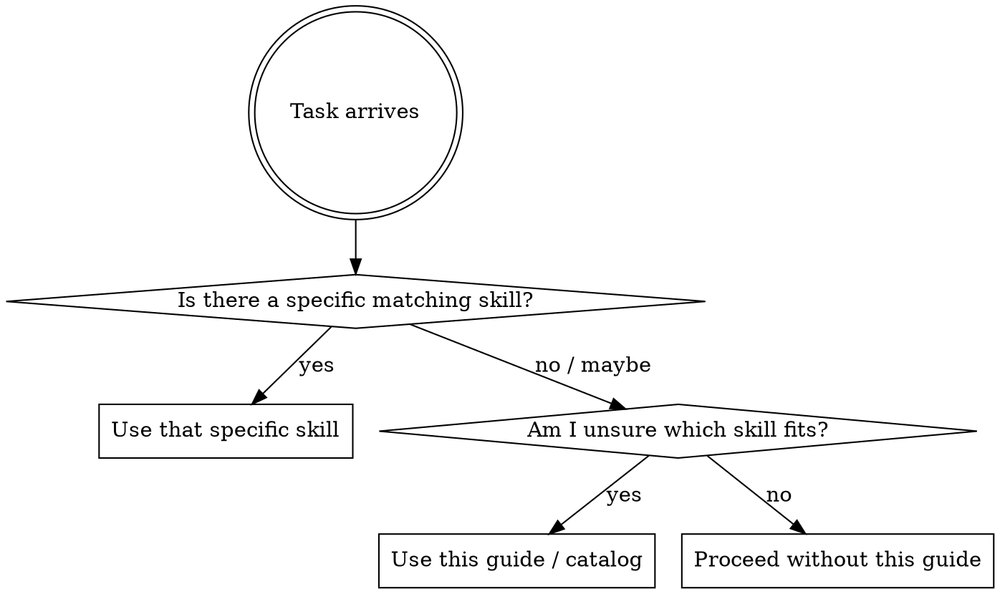

# Using Superpowers in OpenClaw

## Overview

This skill is an OpenClaw-native guide to the skills system.

Use it when you need to:
- find the right skill for a task
- understand how skill invocation works in OpenClaw
- browse the current installed skill inventory
- translate a cross-platform Superpowers instruction into OpenClaw behavior

Do **not** use this skill as a substitute for task-specific skills like debugging, planning, TDD, or code review. This guide routes you to the right skill; it does not replace the real workflow skill.

## OpenClaw-first rule

OpenClaw already scans the available skills and system guidance before responding. You do **not** need to force a separate skill-discovery ritual before every message.

Instead:
1. If a specific skill clearly matches the task, use that skill.
2. If you are unsure which skill fits, use this guide to choose.
3. Prefer the **most specific** applicable skill over broad orientation material.

## How OpenClaw uses skills

- Skills are discovered from the installed skill set and selected based on the request.
- In OpenClaw, the agent may read a skill file directly as part of the workflow.
- Some other harnesses expose explicit skill activation tools; OpenClaw users should follow OpenClaw's local runtime behavior instead of copying foreign platform rituals.

See `references/openclaw-tools.md` for tool mapping and `references/openclaw-skills-catalog.md` for the current skill inventory.

## Core workflow

When deciding whether to use a skill:

## Installed skill inventory

### Core installed engineering/process skills
- `brainstorming`
- `writing-plans`
- `test-driven-development`
- `systematic-debugging`
- `verification-before-completion`
- `subagent-driven-development`

### Additional OpenClaw-local skills already available
- `brainstorm-lite`
- `spec-reviewer`
- `plan-writer`
- `skill-creator`
- other environment/domain-specific local skills

### Review / rollout candidates in the Superpowers lane
- `requesting-code-review`
- `receiving-code-review`
- `dispatching-parallel-agents`
- `writing-skills`
- `using-superpowers` (this guide)

### Deferred / conditional candidates
- `executing-plans`
- `finishing-a-development-branch`

### Skip-for-now candidates
- `using-git-worktrees`

## When to use this guide

Use this guide when:
- you need a quick inventory of available skills
- you need to understand which skill category fits the task
- a Superpowers skill mentions Claude-native behavior and you need the OpenClaw equivalent
- you are deciding whether a task should route to planning, debugging, TDD, review, or subagent execution

Do **not** use this guide when:
- a specific skill already clearly matches the task
- you are trying to avoid using a stricter workflow skill
- you need implementation details rather than routing/discovery help

## Priority rules

When multiple skills could apply:

1. Use the most specific skill.
2. Use process-discipline skills before implementation habits.
3. Use this guide only when the routing decision is unclear.

Examples:
- "Fix this bug" → `systematic-debugging` first
- "Implement this feature" → `brainstorming` or `brainstorm-lite`, then `writing-plans`, then execution skills
- "Did we build the right thing?" → `spec-reviewer`
- "Should I use a review skill or a planning skill here?" → this guide can help

## Cross-platform note

This adapted skill keeps secondary references for non-OpenClaw environments, but OpenClaw guidance is primary here.

- OpenClaw mapping: `references/openclaw-tools.md`
- Codex mapping: `references/codex-tools.md`
- Gemini mapping: `references/gemini-tools.md`

If a cross-platform reference conflicts with OpenClaw-specific instructions, follow the OpenClaw guidance.

## Red flags

These are signs you are using this guide incorrectly:

- "I'm reading the catalog instead of using the actual debugging skill."
- "I'm using orientation material to avoid TDD/review/debugging discipline."
- "I already know the matching skill, but I'm stalling here anyway."
- "I'm treating another platform's invocation ritual as mandatory in OpenClaw."

## Success condition

This guide is successful when it helps you quickly answer:
- What skill should I use?
- How does that map to OpenClaw behavior?
- What is installed vs still in rollout?

Then you should leave this guide and use the actual task-specific skill.
